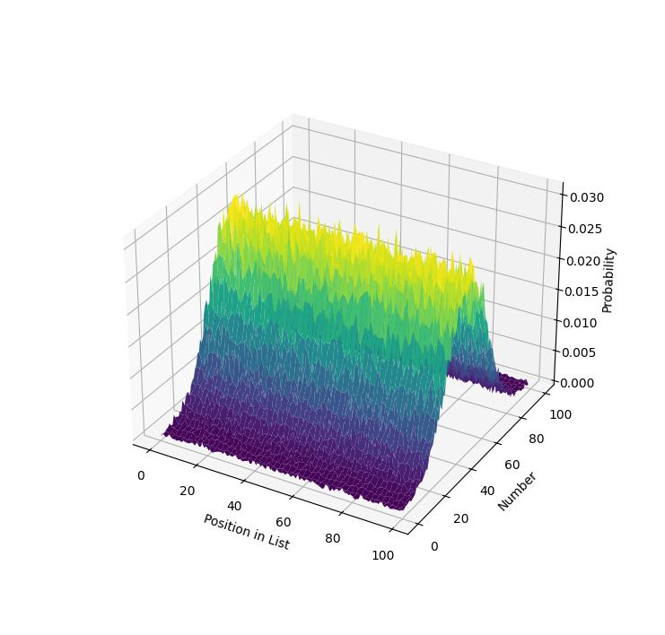

# divider validator
number distribution plotter for [divider task](#the-task) solution validation.


_normal distribution is present on this figure as an example._

## the task

> you have an integer X. divide it into N parts randomly.
> write a function `f(x, n) -> list[int]`

edit `example.py` and run it to validate the distribution.

## run
```console
pipenv install
pipenv shell
python3 ./example.py
```

## license
MIT
